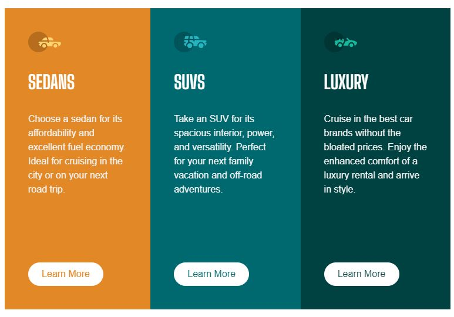

# Frontend Mentor - 3-column preview card component solution

This is a solution to the [3-column preview card component challenge on Frontend Mentor](https://www.frontendmentor.io/challenges/3column-preview-card-component-pH92eAR2-). Frontend Mentor challenges help you improve your coding skills by building realistic projects. 

## Table of contents

- [Overview](#overview)
  - [The challenge](#the-challenge)
  - [Screenshot](#screenshots)
  - [Links](#links)
- [My process](#my-process)
  - [Built with](#built-with)
  - [What I learned](#what-i-learned)
  - [Continued development](#continued-development)
  - [Useful resources](#useful-resources)
- [Author](#author)
- [Acknowledgments](#acknowledgments)

**Note: Delete this note and update the table of contents based on what sections you keep.**

## Overview

### The challenge

Users should be able to:

- View the optimal layout depending on their device's screen size
- See hover states for interactive elements

## Screenshots

### Screenshot Desktop

### Screenshot Mobile

### Links

- Solution URL: [Solution](https://your-solution-url.com)
- Live Site URL: [Live Site](https://unknownbuilder.github.io/FEmentor_three_column_preview_card)

## My process

### Built with

- CSS Flexbox
- CSS Grid

### What I learned

Used CSS Grid once again. It was good practice and it simplified getting the overall layout done. I'll keep using it. 

### Continued development

I've decided that I'm going to do all of the newbie challenges on Frontend Mentor and work my way up to intermediate. While I'm doing intemediate, I'm going to redo the newbie challenges using Svelt and Tailwind CSS as I think that combo is simply beautiful. This might change as I get more exeprience and actually start using what I've learned but for now, this is my path forward. 

## Author

- Github - [Developing Hephaestus](https://github.com/UnknownBuilder)
- Frontend Mentor - [Developing Hephaestus](https://www.frontendmentor.io/profile/UnknownBuilder)

## Acknowledgments

Although unrealated to this challenge but I'm going to give a shout out to [Theo-t3.gg](https://www.youtube.com/@t3dotgg) for making sense of UI Libraries. It was confusing me to the end of complete paralysis. I didn't understand what the difference was between TailwindUI vs Boostrap vs SASS. I was lost, again, newbie here. UNTIL. I saw his YouTube video on the subject: 

[CSS in 2023 - Tailwind vs MUI vs Boostrap vs Chakra...](vshttps://www.youtube.com/watch?v=CQuTF-bkOgc&ab_channel=Theo-t3%E2%80%A4gg)
